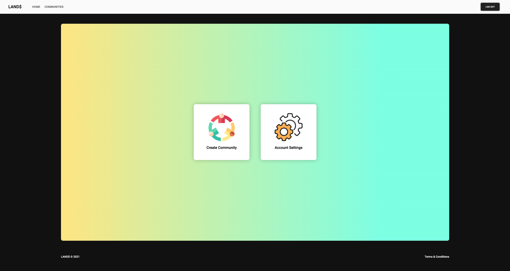

## LANDS

# Description

A simple way to create communities and organize them.

# Screenshots

# Technologies Used
- Nodejs (Express, Mongoose & EJS)
- HTML
- CSS

# Getting Started
Check out the [Trello Board](https://trello.com/b/SDqMqNPr/project-2-user-stories).
You can also access the app [here](https://lands-connect.herokuapp.com/)

# Planned Future Improvements
- Better activity integration
- Private communities
- Private messaging